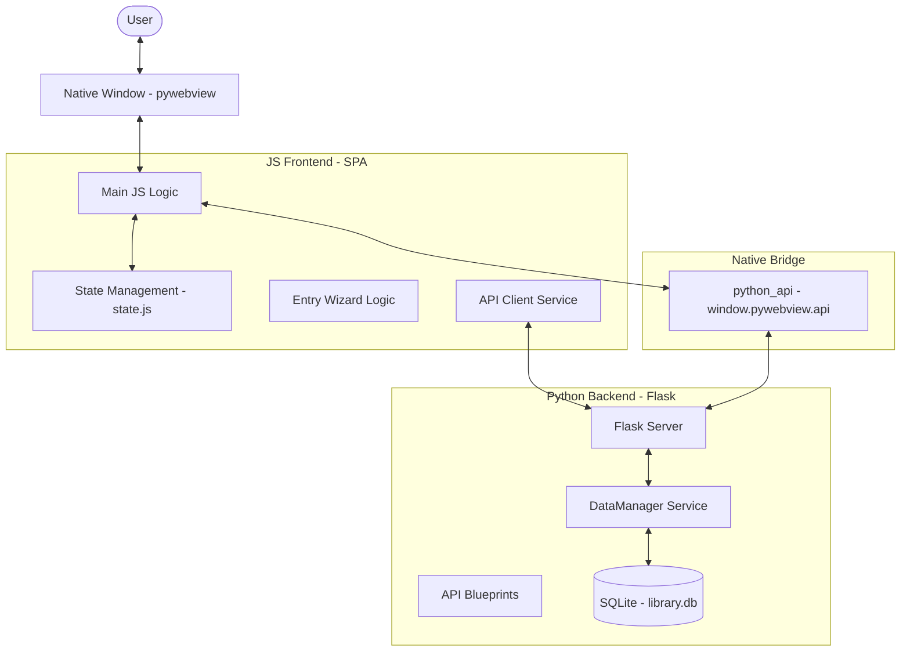

# Architecture & Implementation Overview

## Application Overview

**UpNext** tracks Anime, Manga, Books, Movies, and Series through a glassmorphism interface. Users organize collections, track progress, and discover content.

## Technology Stack

-   **Backend**: Python (Flask) with modular blueprints and service layer.
-   **Data**: SQLite relational persistence (SQLAlchemy).
-   **Frontend**: Vanilla HTML/CSS/JS (SPA pattern) with state management.
-   **Packaging**: PyInstaller for native cross-platform executables.
-   **Native Shell**: `pywebview` for windowing and hardware acceleration.
-   **Tooling**: pytest, black, isort, Chart.js.

---

## 🗺️ System Architecture

---

## 🔄 Development Workflow

For developers looking to extend UpNext:

1.  **UI Adjustments**: All styling is handled in `app/static/css/style.css`. We use CSS variables for theme colors and glassmorphism levels.
2.  **Adding API Endpoints**: New routes should be added to the appropriate blueprint in `app/routes/`.
3.  **State Logic**: If adding new UI features, register the state in `app/static/js/state.js` to ensure it is correctly persisted and globally accessible.
4.  **Database Migration**: Since we use SQLAlchemy, model changes in `app/models.py` will require a database migration or a fresh library creation.

---

## 📂 Key Components

### 1. Backend Services
- **`DataManager`**: The core abstraction layer over SQLAlchemy. It handles complex relational operations across multiple tables (Covers, UserData, Metadata) and ensures data normalization.
- **`AppLifecycle`**: Manages the startup sequence: initializing the Flask thread, waiting for the port to open, and launching the `pywebview` window.
- **`ConfigManager`**: Handles `config.json` serialization, including application settings, database history, and window state.

### 2. Frontend Core
- **State Management (`state.js`)**: A centralized, lightweight store inspired by Redux. It tracks everything from filter criteria and UI modes (Dark/Light) to wizard navigation and persistent user settings.
- **Entry Wizard (`wizard_logic.js`)**: Manages the complex 12-step form logic, including dynamic step skipping based on media types and field visibility.
- **The Native Bridge**: UpNext uses a custom `JsApi` class in Python exposed as `window.pywebview.api`. This allows the JS frontend to call Python methods directly for saving configurations or querying system-level information.

### 3. Release Calendar System
- **Event Generation**: Supports single point-in-time releases or automated recurring series (Daily/Weekly frequency).
- **Overdue Tracking**: A specialized service that identifies "missed" consumption dates and alerts the user on the next launch.

### 4. Data Persistence (6-Table Schema)
UpNext uses a highly normalized SQLite schema to ensure data integrity:
- **`MediaItem`**: Core entity (Title, Type, Links, Authors).
- **`MediaCover`**: Binary BLOB storage for cover images and mime types.
- **`MediaUserData`**: Tracking fields (Status, Rating, Progress, Privacy).
- **`MediaMetadata`**: Technical stats (Episodes, Chapters, Word Counts).
- **`MediaRelease`**: Calendar events linked to items.
- **`TagMeta`**: Global tag metadata (Unique Colors, Descriptions).

---

## 📦 Build & Packaging

The application is packaged into a single binary using **PyInstaller**.
- **Asset Resolution**: Uses a custom `ResourcePath` utility to resolve static assets and templates whether running from source or from the temporary directory created by the executable (`sys._MEIPASS`).
- **One-File Mode**: All dependencies, including the Python runtime and static assets, are bundled into the final executable.
