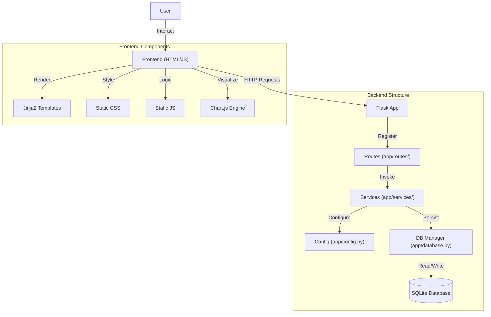

# Architecture & Implementation Overview

## Application Overview

**UpNext** tracks Anime, Manga, Books, Movies, and Series through a glassmorphism interface. Users organize collections, track progress, and discover content.

## Technology Stack

-   **Backend**: Python (Flask) with modular blueprints and service layer.
-   **Data**: SQLite relational persistence.
-   **Frontend**: Vanilla HTML/CSS/JS with Lucide icons.
-   **Packaging**: PyInstaller for native cross-platform executables.
-   **Tooling**: pytest, black, isort, Chart.js.

## System Architecture

## Directory Structure

Modular project structure:

-   **`manage.py`**: Unified entry point for `run`, `build`, and `clean` commands.
-   **`app/`**: Core source code.
    -   `routes/`: API endpoints for library and releases.
    -   `services/`: Business logic, window lifecycle, and native integration.
    -   `models.py`: Normalized SQLAlchemy models.
    -   `database.py`: Session management.
    -   `utils/`: Win32 icon injection and config utilities.
    -   `static/`: Production assets (img, js, css).
    -   `templates/`: Jinja2 templates.
-   **`scripts/`**: Automation tools for build and cleanup.
    -   `build.py`: Orchestrates the PyInstaller compilation process.
    -   `clean.py`: Wipes build artifacts and Python cache.
-   **`data/`**: Local SQLite databases and covers.

## Key Components

### Management Script (`manage.py`)
Universal entry point:
-   **Run**: Launches multi-threaded Flask backend and native GUI.
-   **Build**: Produces optimized, single-file native executable.
-   **Clean**: Removes temporary production and development files.

### Release Calendar System
Granular release tracking:
-   **Future Events**: Recurring release generation (weekly).
-   **Overdue Logic**: Missed release notifications based on system time.
-   **Dynamic Linkage**: Associates releases with library items for metadata access.

### Data Persistence
Local SQLite storage in `data/` for high-performance relational queries and offline privacy.

#### Normalized Database Schema
5-table architecture (default `library.db`):
1.  **`MediaItem`**: Lightweight registry for fast listing.
2.  **`MediaCover`**: Separate BLOB storage for heavy binary image data.
3.  **`MediaUserData`**: User tracking stats, ratings, and progress.
4.  **`MediaMetadata`**: Technical spec storage (counts, durations).
5.  **`MediaRelease`**: Event entities for the calendar.

### Build & Packaging
Optimized desktop distribution:
-   **Asset Injection**: Templates and static files bundled into binary.
-   **Native Integration**: Custom Win32 logic for icon injection.
-   **Portability**: Executable runs directly without host Python installation.
