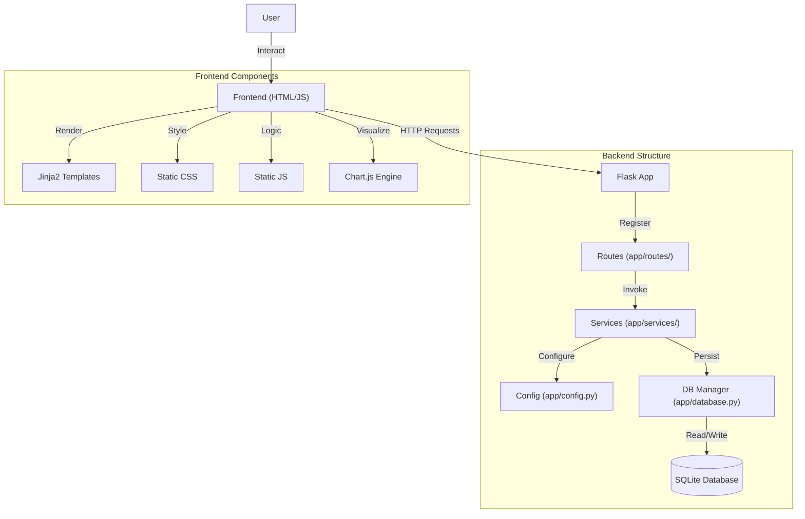

# Architecture & Implementation Overview

## Application Overview

**UpNext** is a personal media library manager designed to track Anime, Manga, Books, Movies, and Series. It provides a clean, modern interface for users to organize their collections, track progress, and discover new content.

## Technology Stack

-   **Backend**: Python (Flask)
    -   **Modular Design**: Blueprints for routing, Service layer for logic.
    -   **Data**: SQLite for robust, relational persistence.
-   **Frontend**: HTML, CSS (Vanilla), JavaScript (Vanilla)
    -   **Design**: Glassmorphism aesthetic.
    -   **Icons**: Lucide Icons.
-   **Packaging**: PyInstaller
    -   **Cross-Platform**: Builds native executables for Linux and Windows.
-   **Tooling**:
    -   `pytest`, `black`, `isort` for quality assurance.
    -   `Chart.js` & `chartjs-plugin-datalabels` for data visualization.

## System Architecture

## Directory Structure

The project follows a clean, modular structure:

-   **`manage.py`**: The unified entry point for all commands (`run`, `build`, `clean`).
-   **`app/`**: Core application source code.
    -   `routes/`: Flask Blueprints defining API endpoints.
    -   `services/`: Business logic and data manipulation.
    -   `models.py`: SQLAlchemy database models.
    -   `database.py`: Database connection and session management.
    -   `utils/`: Helper functions (logging, data loading).
    -   `static/`: Assets (CSS, JS, images, icons).
        -   `js/stats.js`: Calculation and rendering logic for the dashboard.
    -   `templates/`: HTML Jinja2 templates.
        -   `components/stats_modal.html`: Modal structure for statistics.
-   **`scripts/`**: Helper scripts used by `manage.py`.
    -   `run.py`: Server startup logic.
    -   `build.py`: PyInstaller build process.
    -   `clean.py`: Cleanup utilities.
    -   `convert_icon.py`: Icon processing tools.
-   **`data/`**: User data storage (database, uploaded images).

## Key Components

### Management Script (`manage.py`)
A single wrapper script that handles the entire development lifecycle:
-   **Smart Venv**: Automatically detects and uses the virtual environment.
-   **Run**: Launches the app and browser.
-   **Build**: Compiles the app to a standalone executable in the project root.
-   **Clean**: Removes build artifacts and temporary files.

### Data Persistence
Data is stored locally in `data/library.db` using SQLite. This ensures reliability and relational integrity while remaining highly portable. 

#### Normalized Database Schema
The application uses a 5-table normalized architecture to optimize performance and scalability:
1.  **`MediaItem`**: The core registry (ID, Title, Type). Kept lightweight for fast listing and searching.
2.  **`MediaCover`**: Stores large binary image data (BLOBs) separately to prevent database page bloat.
3.  **`MediaUserData`**: Stores user-specific tracking (Status, Rating, Progress, Completed Date, Reread Count).
4.  **`MediaMetadata`**: Stores technical statistics (Episode/Volume/Page counts, Duration).
5.  **`MediaRelease`**: Tracks specific release events (Volumes, Episodes) for the calendar system.

**Note on Images**: By separating binary data into `MediaCover`, the main library remains lightning-fast even with hundreds of high-res covers.

### Build System
The build process is fully automated via `scripts/build.py`:
1.  **Icon Generation**: Converts SVGs to platform-specific formats (ICO/PNG).
2.  **Compilation**: Uses PyInstaller to bundle Python and dependencies.
3.  **Deployment**: Moves the final executable to the project root and cleans up intermediate `build/` files.
4.  **Integration**: On Linux, generates a `.desktop` entry for system integration.
