# UpNext - Personal Media Tracker

**UpNext** is a sophisticated, local-first web application designed for tracking your personal media consumption. Whether it's Anime, Manga, Novels, Movies, or Series, UpNext provides a beautifully crafted glassmorphism interface to organize your collections, track your progress, and visualize your habits.

---

## ✨ Features

-   **Multi-Type Tracking**: Deep support for **Anime**, **Manga**, **Books**, **Movies**, and **Series** with metadata tailored to each medium.
-   **Universal Discovery**: 
    -   **AniList Integration**: Instant fetching for Anime and Manga with full metadata and high-quality covers.
    -   **TMDB Support**: Comprehensive database for Movies and TV Series.
    -   **OpenLibrary**: Access to a vast catalog of Books and Novels.
    -   **MangaDex & TVMaze**: Native fallback and specialized detail fetching for Manga and Series.
-   **Modern Wizard Entry**: A dynamic 12-step wizard that adapts its questions based on the media type and status you select.
-   **Integrated Image Editor**: A native tool for cropping, resizing, and optimizing cover images. Includes a **Resolution Warning** system to ensure your library always looks premium.
-   **Advanced Search & Filtering**: 
    -   Omnisearch by Title or Alternate Titles.
    -   Prefix-based filtering: `universe="MCU"`, `series="One Piece"`, `author="Oda"`, `tag="Action"`.
    -   Compound filtering mode for complex queries.
-   **Status Workflow**: Manage content through a lifecycle: Planning → Reading/Watching → Completed, or use statuses like "Anticipating" (waiting for release) and "On Hold".
-   **Automated Technical Stats**: Automatically calculate total chapters, episode counts, and durations from child items (seasons/volumes) with manual override support.
-   **Tag Customization**: Create custom tags with persistent colors and descriptions to categorize your library beyond media types.
-   **Release Calendar**: A dedicated calendar view to track upcoming releases with support for recurring events (weekly/daily) and overdue notifications with a "Catch-up" workflow.
-   **Library Statistics**: Visualize your consumption habits with interactive Chart.js graphs (Rating distribution, Type breakdown, and Growth over time).
-   **Privacy & Privacy Mode**: Mark sensitive entries as "Hidden" and use the global "Privacy Mode" toggle (Shield icon) to instantly conceal them.
-   **Multi-Database Support**: Easily switch between specialized libraries (e.g., "Main", "Vault") or create new ones on the fly via the built-in library manager.
-   **Dynamic Export & Clipboard**: 
    -   **Visual Export**: Generate beautiful HTML card grids or lists.
    -   **Raw Data**: Export to JSON, CSV, or XML.
    -   **Clipboard Building Blocks**: A powerful system to visually reorder fields using drag-and-drop for clean sharing.

---

## 🎨 UI & Aesthetics

-   **Glassmorphism**: Elegant translucent panels with backdrop blurring and subtle borders.
-   **Adaptive Themes**: Native Dark and Light mode support with curated color palettes.
-   **Responsive Design**: A fluid layout that adapts from large desktop screens down to narrow windows.
-   **Interactive Elements**: Smooth transitions, hover effects, and micro-animations for a "live" feel.

---

## ⌨️ Keyboard Shortcuts

Speed up your workflow with global shortcuts:

-   **[N]**: New Entry Wizard
-   **[F]**: Focus Search Bar
-   **[T]**: Open Library Statistics
-   **[C]**: Open Release Calendar
-   **[O]**: System Menu / Controls
-   **[W/S]**: Scroll library up/down
-   **[ESC]**: Close Modals / Clear Search

---

## 🖼️ Visual Showcase

Experience the elegance and depth of **UpNext**. Our interface combines sophisticated glassmorphism with high-density information display and powerful management tools.

### 📚 Core Library & Views

The main interface provides multiple ways to view and interact with your collection, from high-fidelity grids to dense lists.

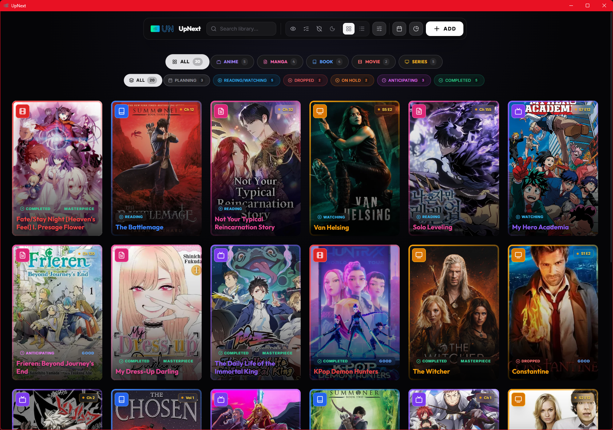
*The default wide grid layout, showcasing a diverse library and glassmorphic icons.*

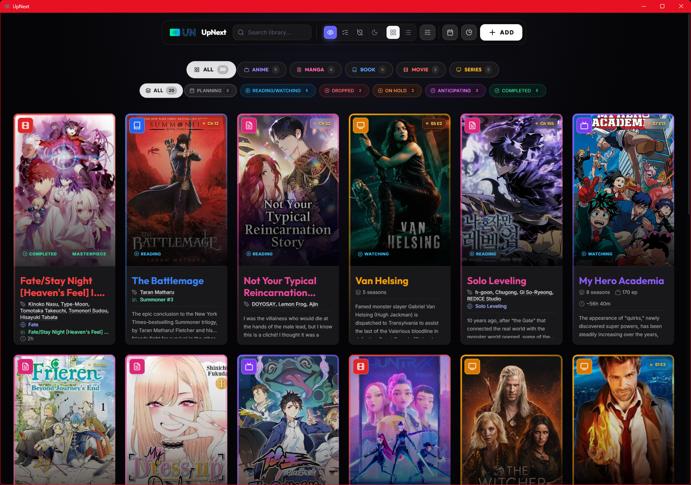
*Detail Mode: Instantly see titles, authors, and studios directly on the covers.*

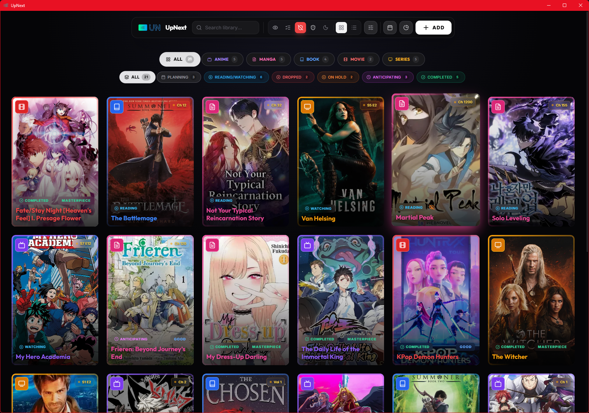
*Enabled show hidden, fifth item is hidden.*

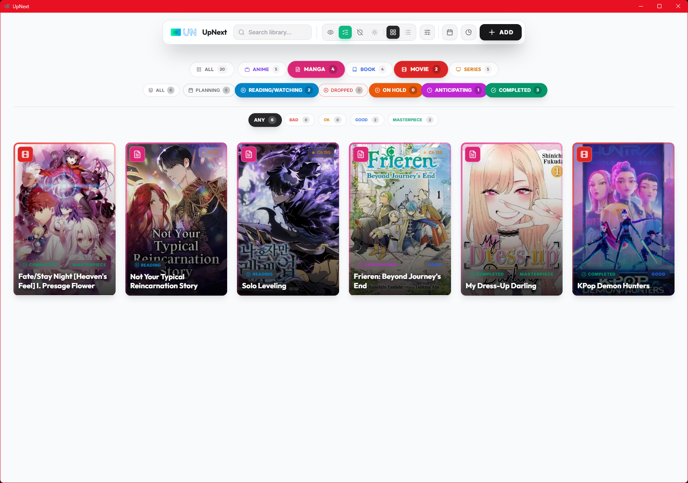
*A specialized flashbang view of a Manga + Movie collection with custom status indicators.*

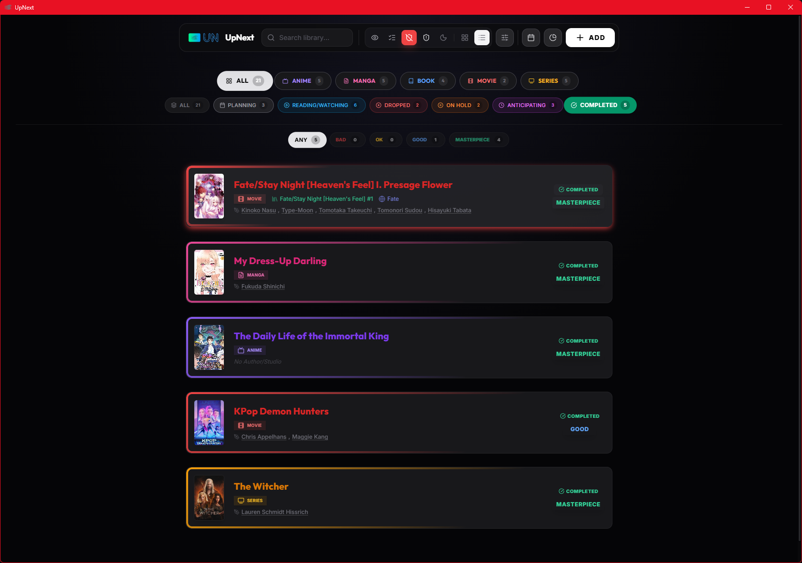
*For power users: A high-density list view for managing large collections with ease.*

### 🔍 Discovery & Fast Entry

Adding new items is effortless thanks to deep API integrations and a streamlined entry flow.

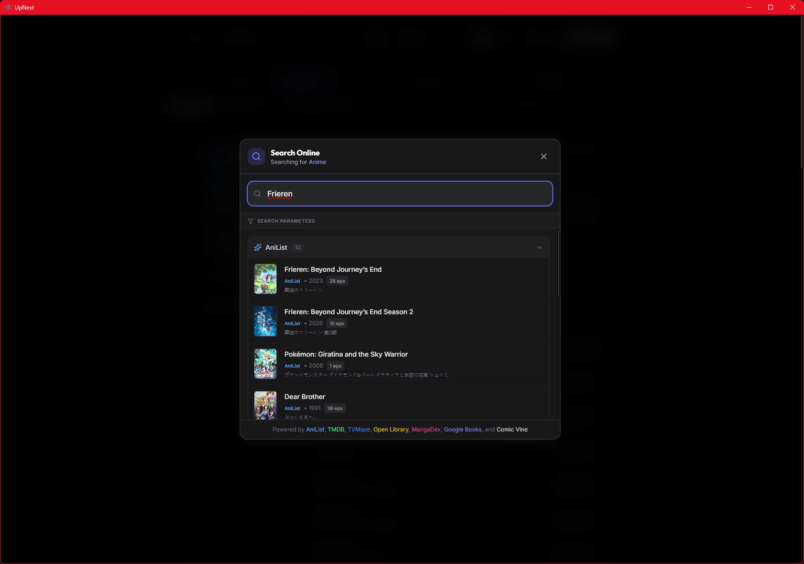
*Universal Discovery: Searching AniList (and other APIs) for Frieren metadata and covers.*

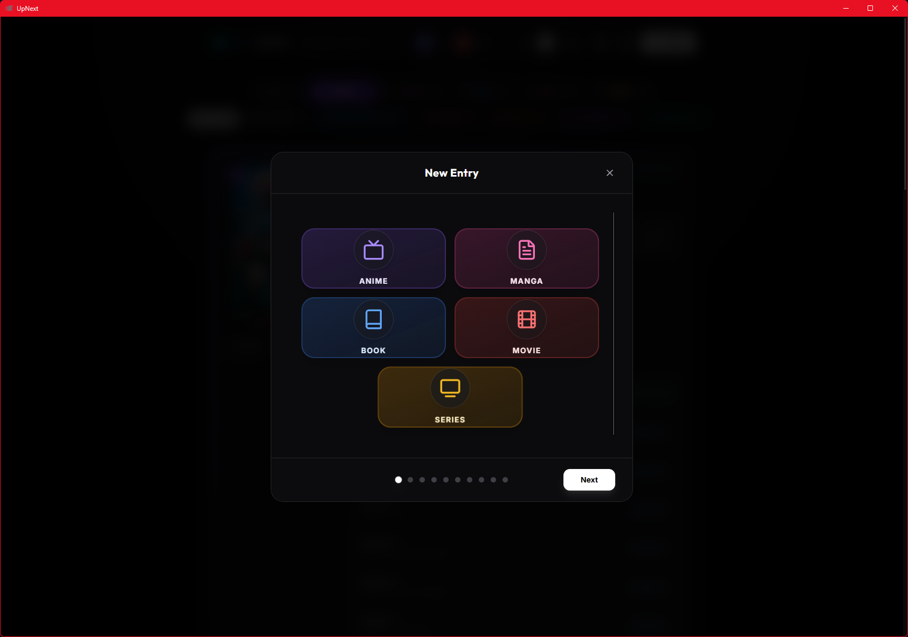
*Adaptive Wizard: A frictionless 12-step process that tailors its questions specifically to the media type you are adding.*

### 📋 Deep Tracking & Privacy

UpNext goes beyond simple "watched" counts, offering granular tracking for seasons, volumes, and private entries.

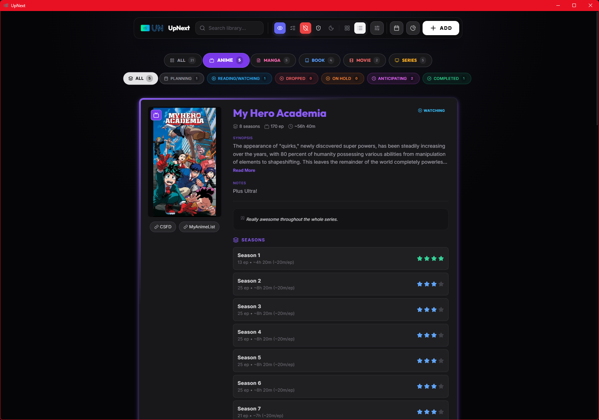
*Granular Anime Tracking: Manage seasons, episodes, and individual progress with automatic technical stats.*

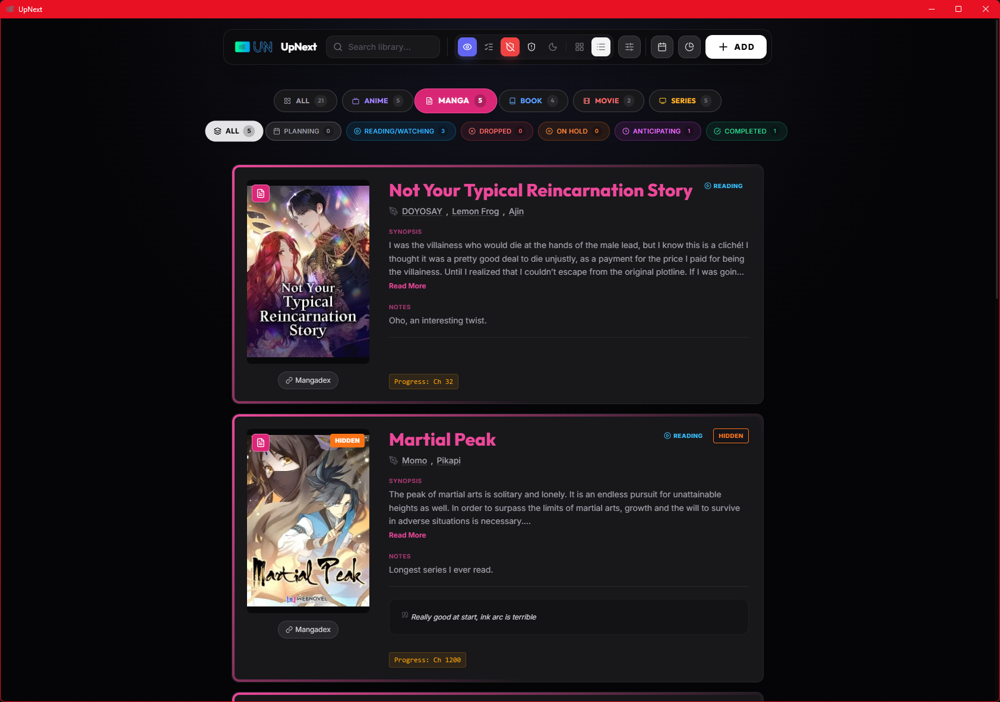
*Deep Manga information, including local "Hidden" status for private entries in your vault.*

### 📤 Data Management & Export

Export your data exactly how you want it, whether for backup or sharing with a community.

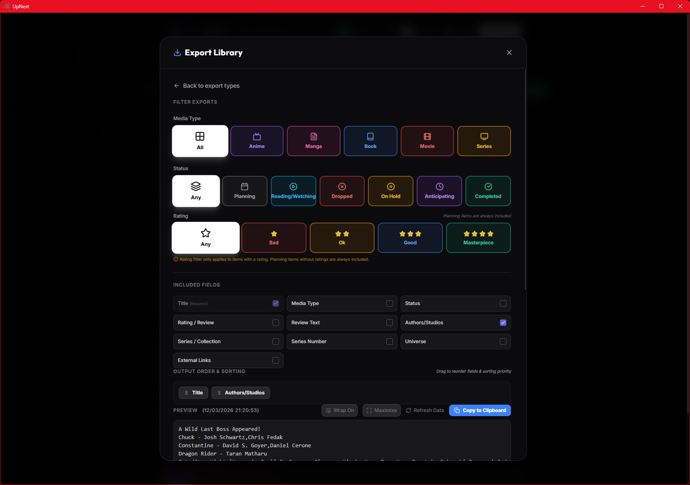
*Clipboard Builder: Use a visual drag-and-drop system to choose and reorder fields for the perfect social media snippet.*

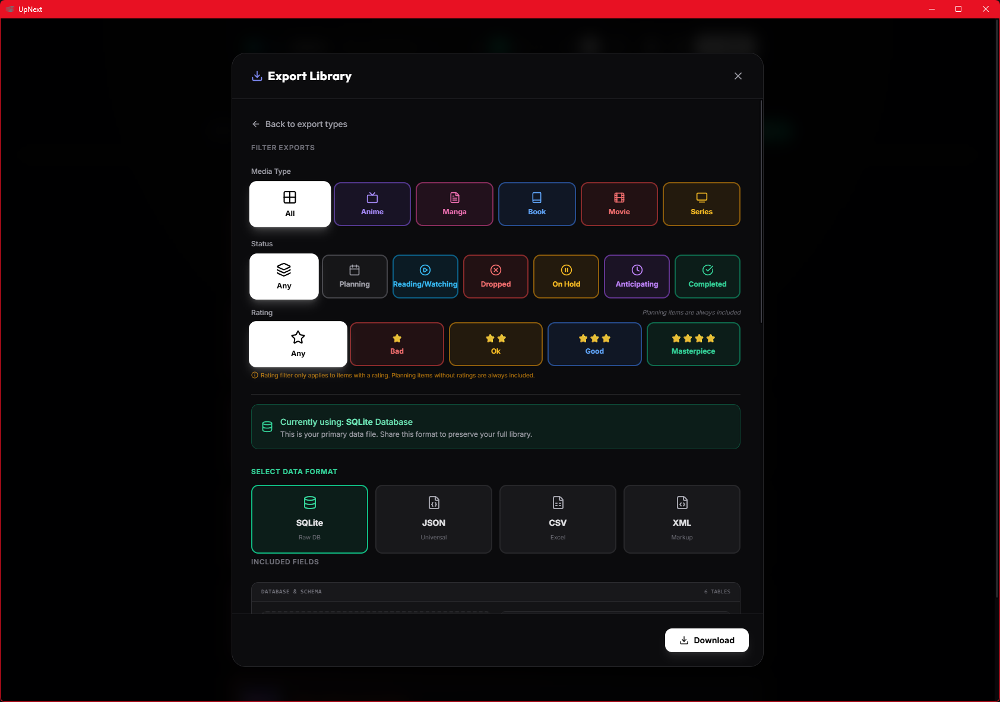
*Universal Export: Native support for SQL, JSON, CSV, and XML formats to ensure your data stays yours.*

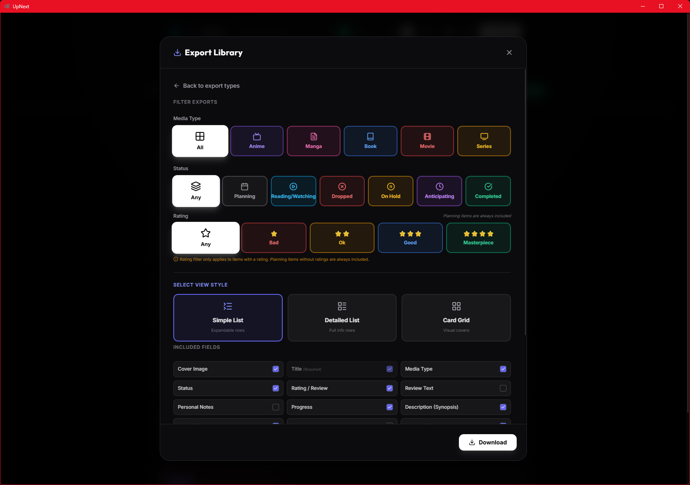
*Visual Export Options: Customize the layout and style of your exported card grids or lists.*

### ⚙️ System & Support

Accessibility and configuration are key components of the UpNext experience.

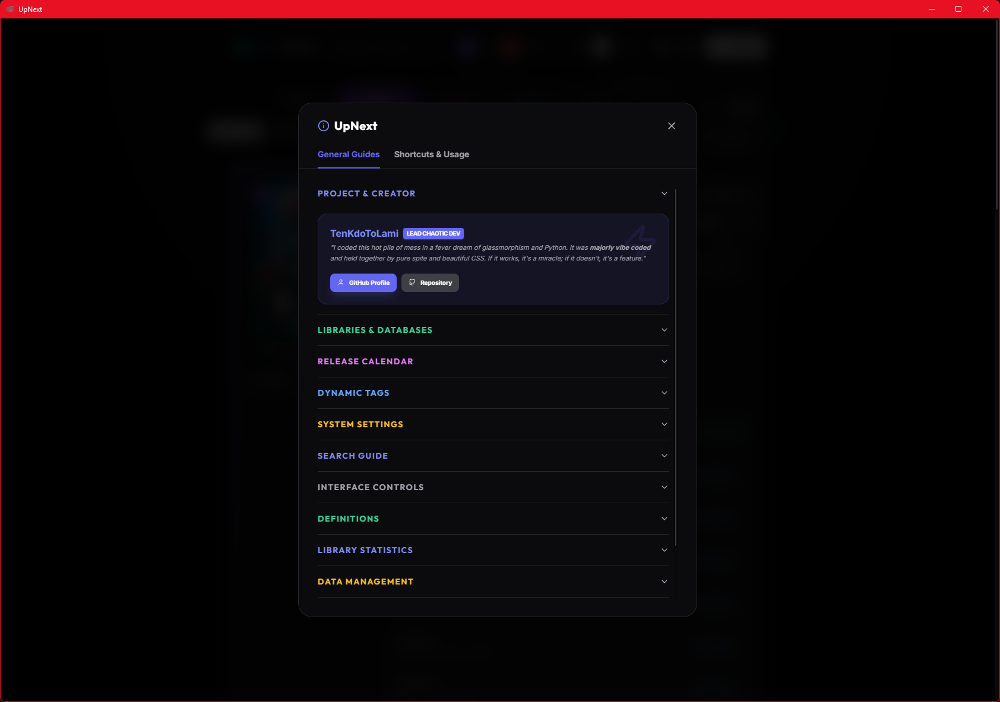
*Integrated Documentation: Quick access to shortcuts, usage guides, and project details.*

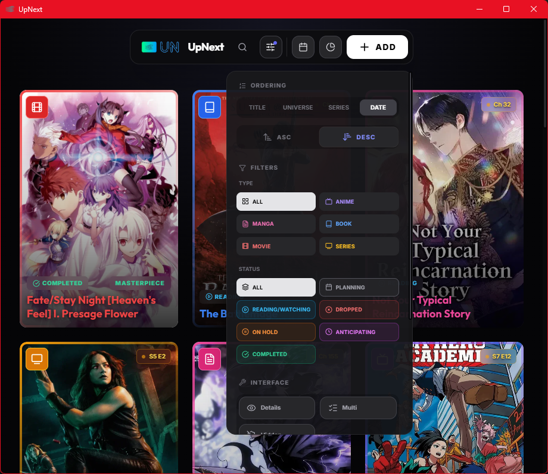
*Adaptive Scaling: The interface automatically adjusts to your screen size and resolution.*

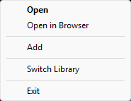
*Tray Integration: Quick actions (Open, Add, Switch Library) available directly from your taskbar.*

---

## 🚀 Getting Started

### Prerequisites

-   **Python 3.11+**
-   **System Dependencies (Linux)**:
    ```bash
    sudo apt install libgirepository1.0-dev libcairo2-dev pkg-config gir1.2-webkit2-4.1
    ```

### Installation

1.  **Clone the Repository**:
    ```bash
    git clone https://github.com/TenKdoToLami/UpNext.git
    cd UpNext
    ```

2.  **Initialize Environment**:
    ```bash
    # Windows
    py -3.11 -m venv .venv
    .\.venv\Scripts\activate
    pip install -r requirements.txt

    # Linux
    python3.11 -m venv .venv
    source .venv/bin/activate
    pip install -r requirements.txt
    ```

3.  **Run Application**:
    ```bash
    python manage.py run
    ```

---

## 🛠️ Project Management

The `manage.py` script is the central hub for development and distribution:

-   `python manage.py run`: Launches the Flask backend and native GUI window.
-   `python manage.py build`: Compiles the entire project into a standalone executable.
-   `python manage.py clean`: Wipes build artifacts and temporary files.

---

## 📄 License
This project is licensed under the [PolyForm Noncommercial License 1.0.0](LICENSE).
**Free for non-commercial use.**
